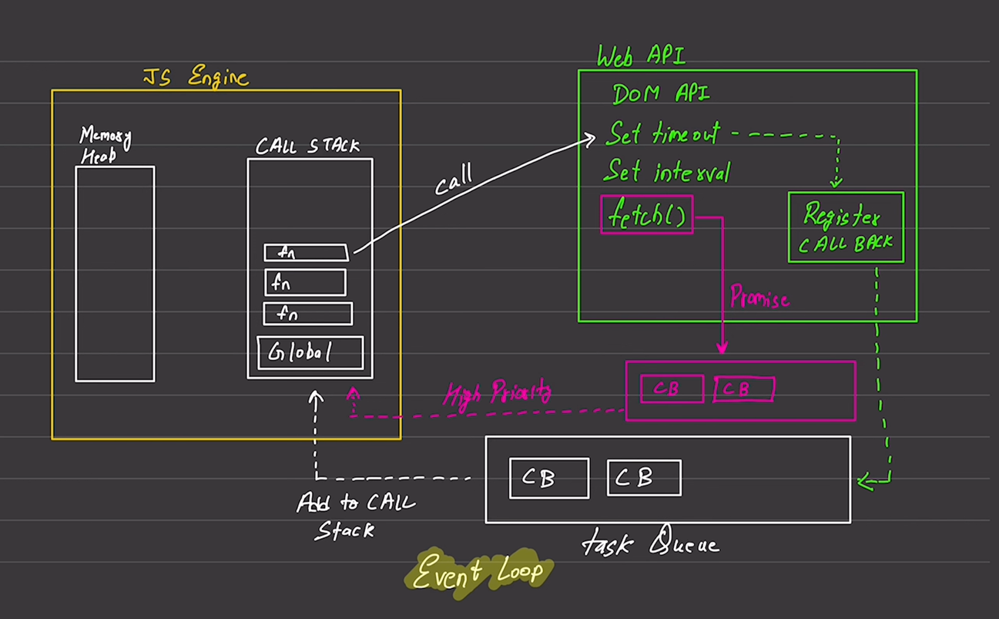

### JavaScript Asynchronous

By default javascript comes
- Synchronous
- Single threaded 

### Execution Context
- exexute one line of code at a time
- console log  -> 1
- console log -> 2

| Blocking code | Non Blocking code |
|---------------|-------------------|
| Block the flow of program | Does not block execution |
| Read the sunc | Read file Async|

